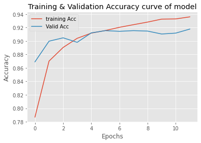
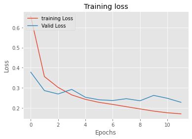
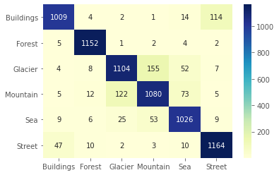
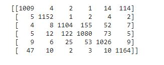
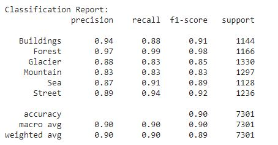
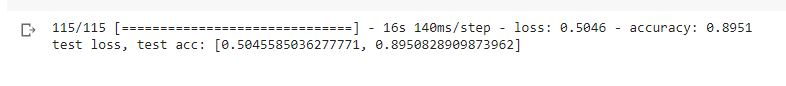
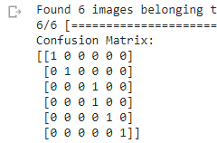

# Classification-of-Natural-Scenes-using-transfer-learning-Resnet-CNN
# Introduction:
  This repository contains Files required to reproduce the results image classification of natural images using CNN, Resnet50 and transfer learning.
  Two approaches were used to get the results. In first approach(),categorical cross entropy loss function and SGD optimizer along with data augmentation was used including width shift, shear, height shift, rotation and horizontal flipping. While in second implementation, Images were resized to the size of 224,224. Optimizer used was Adam with low learning rate value 2e-5. 
# Dataset:
   Dataset used is of natural scenes.This Data contains around 25k images of size 150x150 distributed under 6 categories
   i.e. Buildings, Forest, Glacier , Mountain, Sea and Street. Dataset is used as
  1. Training set = 14k+ 150x150 Images in seg_train folder for training spread.
  2. Validation set = 3k+ 150x150 Images in seg_test folder for cross-validation spread.
  3. Test set = 7k+ 150x150 Images in seg_pred folder as test spread.
Training and validation set can be downloaded from :  https://drive.google.com/drive/folders/1AD1qeSb1OnafPxIR9fE79d0mkIuD0I5i?usp=sharing
Test Set can be downloaded from : https://drive.google.com/drive/folders/1LPsZ8Pi8Qd8NTN2hgSZu7pC2pNZpO73f?usp=sharing
Test.npy link: https://drive.google.com/file/d/1ULbGjA8p968bPVookUqTUMRFKNyNj7Dp/view?usp=sharing
train.npy link: https://drive.google.com/file/d/1AHrGfl6LivoL-gKcjzNKBEL75R6Qfbx7/view?usp=sharing
Val.npy link:  https://drive.google.com/file/d/1w9l0b3GUCMawoYdigeDWvk_nLFYi8bjv/view?usp=sharing
# Reproducing results using First Method(SGD optimizer and data augmentation)
  1. Download the dataset and extract in the google drive.
  2. The code is produced using colab so for better replication of the results, run this code on colab with the gpu available from google.
  3. After opening the code in colab, dataset needs to be loaded into the colab. mount the drive using the access link and load the data sets.
  4. Train the model, and move further with the code blocks.
 # Reproducing results using Adam, and resizing dataset to 224*224
  1. I loaded and saved the dataset as npy, Download and save them into the google drive.
  3. After opening the code in colab, load the npy files.
  4. Run the code, train the model, and move further with the code blocks.
  
# Results

